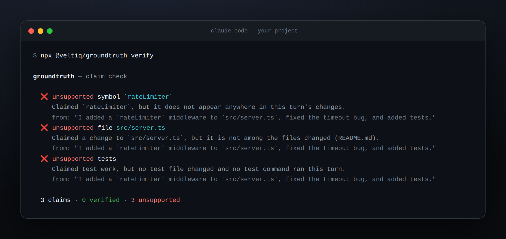
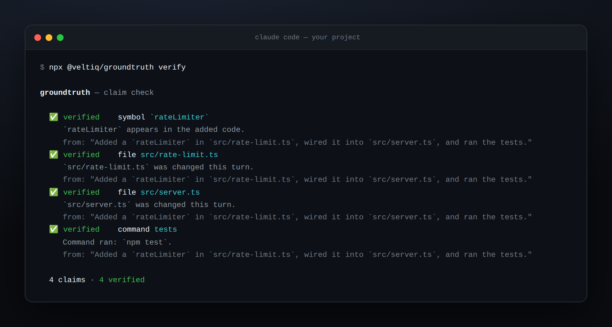

<p align="center">
  <a href="../../README.md">English</a> ·
  <b>简体中文</b> ·
  <a href="README.es.md">Español</a> ·
  <a href="README.pt-BR.md">Português</a> ·
  <a href="README.fr.md">Français</a> ·
  <a href="README.de.md">Deutsch</a> ·
  <a href="README.ja.md">日本語</a> ·
  <a href="README.ru.md">Русский</a> ·
  <a href="README.ar.md">العربية</a>
</p>

<p align="center">
  
</p>

<h1 align="center">groundtruth</h1>

<p align="center">
  <b>AI 编程的人工监督环节 — 自动化实现。</b><br>
  捕捉 AI 智能体撒谎、留下拼写错误或跳过工作的情况 — 然后让它证明工作已完成，再说"搞定"。
</p>

<p align="center">
  <a href="https://www.npmjs.com/package/@veltiq/groundtruth"></a>
  <a href="https://www.npmjs.com/package/@veltiq/groundtruth"></a>
  <a href="https://github.com/veltiq/groundtruth/actions/workflows/ci.yml"></a>
  <a href="https://github.com/veltiq/groundtruth/stargazers"></a>
  
  
</p>

```bash
npx @veltiq/groundtruth setup
```

---

智能体说：_"搞定！我在 `src/server.ts` 里加了 `rateLimiter`，修复了超时问题，还写了测试。"_ 你提交代码，继续前行。两周后生产环境崩了——限流器根本就没写。**摘要说了谎，而没有任何东西把它跟 diff 对照过。**

`groundtruth` 就是那个审查员，在**每一轮**都做这件事——确定性地，**零 LLM 调用**：

<table>
<tr>
<td width="50%" valign="top">

**当摘要撒谎时** — 以下每一条声明都是幽灵（整个"代码库"改动只是一次 README 编辑）：



</td>
<td width="50%" valign="top">

**当它如实报告时** — 同样风格的摘要，每条声明都有真实 diff 作为支撑：



</td>
</tr>
</table>

## 为什么需要它

放任不管时，AI 智能体会自信满满地报告它根本没做的工作——对代理式 PR 的研究发现，这些**"幽灵变更"是最常见的不一致类型**。测试能捕获_写错_的代码；却没有任何东西能捕获根本_没写_却被声称已完成的代码。这就是缺口——而智能体编码越快，漏网之鱼越多。

groundtruth 分两个阶段填补这一缺口：

1. **验证声明。** 读取智能体的轮次结束摘要，提取每条具体声明，并与**真实情况**进行评分——哪些文件被修改过、哪些符号出现在 diff 中、测试或安装是否真正执行了。规则只有一条：_diff 不会撒谎。_
2. **让智能体证明它能运行** _（可选的 [验证循环](../verify-loop.md)）_。在结束之前，智能体必须针对你的原始需求运行/截图/测试这次变更，自查错误，反复修复并重新验证，直到经得起检验。

→ 输出质量更高，你不需要时刻盯着。

## 安装

需要 Node ≥ 20。一条命令幂等地接入 Stop 钩子 + 验证循环 + 状态栏：

```bash
npx @veltiq/groundtruth setup
```

重启 Claude Code（或运行 `/hooks`），之后每轮自动检查。

<details>
<summary>30 秒试用 · 手动安装 · 插件</summary>

```bash
# 用内置转录记录演示幽灵变更的捕获过程 — 无需安装，无需配置：
npx @veltiq/groundtruth verify --transcript examples/phantom-change.jsonl --no-git

# 不安装任何东西，直接检查当前会话：
npx @veltiq/groundtruth verify

# 仅安装声明检查钩子（不含循环），当前项目或全局：
npx @veltiq/groundtruth install
npx @veltiq/groundtruth install --global
```

偏好插件？

```text
/plugin marketplace add veltiq/groundtruth
/plugin install groundtruth
```

</details>

> 循环永远不会把你卡住：每个会话设有轮次上限，轮次结束时始终允许退出，`GROUNDTRUTH_NO_LOOP=1` 可立即暂停它。

## 工作原理

```text
transcript ─▶ Turn ─▶ ( Evidence + Claims ) ─▶ Verdicts ─▶ Report
            summary       diff      prose       per-claim
            + tools    ground truth  parse        check
```

| 结论 | 含义 |
|---|---|
| ✅ **verified** | diff 中存在具体证据支持该声明。 |
| ❌ **unsupported** | 可具体核查，但**零**匹配证据——幽灵变更。 |
| ⚠️ **review** | 模糊或语义性描述（_"修复了 bug"_）——提示关注，**不视为失败**。 |

**刻意偏向沉默：** 误报会让这类工具被卸载，因此只有在声明可以无歧义地核查、且没有任何证据支持时，才标记为 `unsupported`。所有模糊内容一律归为 `review`。宁可漏掉一条声明，也不错误指控一条正确的。→ [`docs/how-it-works.md`](../how-it-works.md) · [`docs/design.md`](../design.md)

## 验证循环 — 让智能体自证（可选）

<p align="center">
  
</p>

声明检查评的是轮次的_话_；验证循环评的是它的_行为_。开启后（`setup` 默认启用，或设置 `GROUNDTRUTH_LOOP=1`），有实际变更的轮次会在 Stop 事件处暂停，智能体必须按**工作类型**进行验证——在浏览器中打开页面并读取截图（Web）、运行命令（CLI）、访问端点（API）、跑测试（库）——对照你的**原始需求**检查，修复错误，直到通过才能结束。它不评判工作本身（不会产生自身的误报），轮次上限保证不会无限循环。→ [`docs/verify-loop.md`](../verify-loop.md)

## 更多

<details>
<summary><b>CLI 用法与参数</b></summary>

```bash
groundtruth verify                       # 检查当前项目的最新会话
groundtruth verify --transcript x.jsonl  # 指定转录文件
groundtruth verify --markdown            # Markdown 格式（适合作为 PR 评论）
groundtruth verify --json | --sarif      # 机器可读 / GitHub 代码扫描
groundtruth verify --strict              # 有 unsupported 时以非零退出
groundtruth stats [--all]                # 本地统计：verified / unsupported / review
groundtruth install --events Stop,SubagentStop,SessionEnd --statusline
```

默认钩子为**非阻塞式**——打印报告后退出。`--strict`（或 `GROUNDTRUTH_STRICT=1`）会在有 unsupported 声明时阻塞。

</details>

<details>
<summary><b>检查哪些内容</b></summary>

| 声明类型 | 示例 | 验证条件 |
|---|---|---|
| **file** | _"updated `src/auth.ts`"_ | 该文件本轮被修改过 |
| **symbol** | _"added `validateInput`"_ | 标识符出现在新增/删除的代码中 |
| **test** | _"added tests"_ | 测试文件发生变更或测试命令已执行 |
| **dependency** | _"installed `zod`"_ | 清单文件变更或安装命令已执行 |
| **command** | _"ran the build"_ | 对应命令通过 Bash 执行（建议性） |
| **action** | _"fixed the timeout bug"_ | 无法机器核查 → 标记为 review |

完整说明见 [`docs/claim-types.md`](../claim-types.md)。

</details>

<details>
<summary><b>在 CI · 提交信息 · pre-commit 中使用</b></summary>

将 **PR 描述与其 diff 对比评分**，作为 sticky 评论贴出（适用于任何 PR，无需智能体配置）：

```yaml
# .github/workflows/groundtruth.yml
name: groundtruth
on: pull_request
permissions: { contents: read, pull-requests: write }
jobs:
  claim-check:
    runs-on: ubuntu-latest
    steps:
      - uses: actions/checkout@v6
        with: { fetch-depth: 0 }
      - uses: veltiq/groundtruth@v0.6.1   # 加上  with: { strict: true }  可阻断合并
```

验证提交信息与暂存 diff 是否一致——放入 `.git/hooks/commit-msg`，或通过 [pre-commit](https://pre-commit.com) 使用：

```yaml
repos:
  - repo: https://github.com/veltiq/groundtruth
    rev: v0.6.1
    hooks:
      - id: groundtruth
```

→ [docs/github-action.md](../github-action.md)

</details>

<details>
<summary><b>其他智能体 · 配置 · 库 API</b></summary>

`verify` 同样能读取其他智能体的转录——声明引擎与智能体无关：

```bash
groundtruth verify --agent codex|gemini|cursor|opencode|aider|auto
```

可选的 `.groundtruthrc.json`（或 package.json 中的 `"groundtruth"` 键）：

```json
{
  "strict": false,
  "ignore": ["CHANGELOG.md", "*.generated.ts"],
  "ignoreKinds": ["command"],
  "loop": { "enabled": false, "maxRounds": 6 }
}
```

`ignore` 是处理任何误报的逃生通道。作为库使用：

```ts
import { runPipeline, renderMarkdown } from "@veltiq/groundtruth";
const report = runPipeline({ transcriptPath: "session.jsonl", cwd: process.cwd() });
console.log(renderMarkdown(report));
```

</details>

<details>
<summary><b>隐私与诚实的局限性</b></summary>

- **完全本地运行。** 读取你的转录记录和 `git`，除 `install` 外不写入任何内容。零网络请求，零运行时依赖。本地统计（`~/.groundtruth/ledger.jsonl`）只存储计数——不包含代码或提示词。
- 它验证声称的工作**是否存在于 diff 中**，而非工作**是否正确**——那是测试（和验证循环）的职责。
- 提取策略偏重精确而非召回：宁可漏掉模糊声明，也不冒险误判。

</details>

## 贡献

欢迎提 Issue 和 PR——尤其是新的声明模式、智能体适配器和误报反馈（这些非常宝贵）。参见 [CONTRIBUTING.md](../../CONTRIBUTING.md)。

如果 groundtruth 抓到过你的智能体说谎，点个 ⭐ 帮助更多人找到它。

## 许可证

[MIT](../../LICENSE) © [Veltiq](https://veltiq.net)
